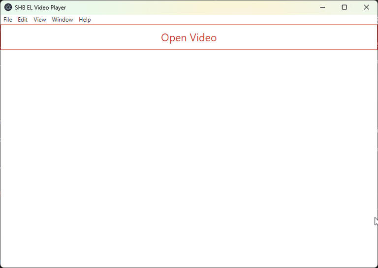
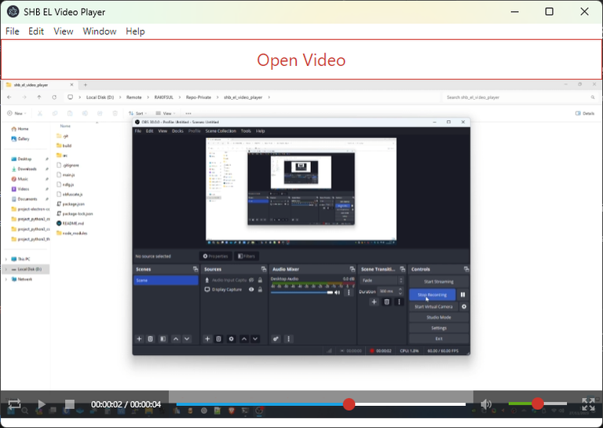

# Studi Kasus Electron JS Membuat Aplikasi Video Player

-   [Studi Kasus Electron JS Membuat Aplikasi Video Player](#studi-kasus-electron-js-membuat-aplikasi-video-player)
    -   [Cara Mencoba Kode Ini](#cara-mencoba-kode-ini)
        -   [Mode Development](#mode-development)
        -   [Mode Production](#mode-production)
    -   [Source Code Project Ini](#source-code-project-ini)
    -   [Jika Ingin Traktir Saya](#jika-ingin-traktir-saya)
    -   [Pendahuluan](#pendahuluan)
    -   [Tujuan](#tujuan)
    -   [Prasyarat](#prasyarat)
    -   [Langkah-langkah](#langkah-langkah)
        -   [Menginisialisasi Project dengan npm](#menginisialisasi-project-dengan-npm)
        -   [Meng-install Dependencies](#meng-install-dependencies)
        -   [Membuat 3 Script Utama](#membuat-3-script-utama)
        -   [Membuat Folder "video_player/build"](#membuat-folder-video_playerbuild)
        -   [Membuat Folder "video_player/src"](#membuat-folder-video_playersrc)
        -   [Membuat Folder "video_player/src/vendor"](#membuat-folder-video_playersrcvendor)
        -   [Membuat Folder "video_player/src/windowhome"](#membuat-folder-video_playersrcwindowhome)
        -   [Pembuatan Project Selesai](#pembuatan-project-selesai)
    -   [Pembahasan](#pembahasan)
        -   [File "video_player/package.json"](#file-video_playerpackagejson)
        -   [File "video_player/ndlg.js"](#file-video_playerndlgjs)
        -   [File "video_player/obfuscate.js"](#file-video_playerobfuscatejs)
        -   [File "video_player/main.js"](#file-video_playermainjs)
        -   [File "video_player/src/app.js" dan "video_player/src/appservices.js"](#file-video_playersrcappjs-dan-video_playersrcappservicesjs)
        -   [Folder "video_player/src/windowhome" beserta Isinya](#folder-video_playersrcwindowhome-beserta-isinya)
    -   [Penutup](#penutup)

## Cara Mencoba Kode Ini

### Mode Development

Untuk menjalankan aplikasi ini dalam mode development, masuk ke dalam folder source code-nya (folder "video_player") via command line, lalu:

```
npm install
```

Selanjutnya, untuk menjalankan kode dalam bentuk plaintext:

```
npm run dev
```

### Mode Production

Untuk menjalankan aplikasi ini dalam mode production, masuk ke dalam folder source code-nya (folder "video_player") via command line, lalu:

```
npm install
```

Generate lisensi pihak ke-3:

```
npm run genlicense
```

Obfuscate kode plaintext nya:

```
npm run obfuscate
```

jalankan kode yang sudah di-obfuscate:

```
npm run start
```

Untuk mem-build installer untuk Windows, obfuscate dahulu, karena kode plaintext untuk development, bukan production:

```
npm run obfuscate
```

Build installer:

```
npm run dist
```

Hasilnya ada di folder "./dist".

## Source Code Project Ini

Source code project ini ada di folder "video_player".

## Jika Ingin Traktir Saya

Artikel ini gratis.

Jika Anda ingin traktir saya, kunjungi link saya:

https://taplink.cc/rakifsul

Di sana ada link untuk traktirnya dan link lainnya.

Selamat menikmati.

## Pendahuluan

File video adalah file yang jika dibuka dengan aplikasi video player, akan menampilkan suatu kumpulan frame gambar yang bergerak seiring waktu.

Contoh yang paling mudah adalah file .mp4.

Jika Anda membuka file .mp4 dengan video player yang dapat memainkan file .mp4, maka akan tampil video-nya.

Video adalah sebuah media yang banyak gunanya.

Mulai dari hiburan hingga edukasi bisa menggunakan video.

Untuk memainkan video, dibutuhkan suatu aplikasi.

Yaitu aplikasi yang dapat menampilkan isi dari file berformat video.

Saat ini, sudah cukup banyak aplikasi pemutar video yang ada di pasaran.

Teknologi yang digunakan untuk membuatnya pun cukup beragam.

Electron adalah salah satunya.

Anda pasti tahu bahwa web browser saat ini bisa memainkan video.

Electron pun bisa dianggap sebagai web browser.

Maka, tidak aneh juga jika Electron menyediakan fitur untuk memainkan video dan memang faktanya demikian.

Bahkan, pembuatan aplikasi video player di Electron hanya memerlukan sedikit baris kode.

Bagaimana kita bisa membuat aplikasi video player dengan Electron? Itulah yang akan dibahas dalam studi kasus kali ini.

Dalam studi kasus ini, saya juga akan memperkenalkan sebuah library CSS bernama Metro UI.

Metro memiliki fitur yang cukup lengkap, salah satunya adalah untuk membuat elemen video player yang sudah memiliki controller-nya.

## Tujuan

Tujuan dari studi kasus ini adalah:

-   Pembaca mengenal Electron, Metro UI, dan bagian-bagiannya.
-   Pembaca mampu menggunakan main process, renderer process, dan preload.
-   Pembaca memahami bahwa pembuatan video player dengan Electron dan Metro UI adalah sangat sederhana.

## Prasyarat

Prasyarat dari studi kasus ini adalah:

-   Menggunakan sistem operasi Windows 10 atau yang lebih baru.
-   Menggunakan Node.js versi 20.9.0 dan npm versi 10.1.0.
-   Menggunakan Visual Studio Code.
-   Telah mengenal HTML, CSS, dan JavaScript sebelumnya.
-   Pernah melakukan coding sebelumnya.
-   Terbiasa menggunakan command line.

## Langkah-langkah

Walaupun saya telah menyediakan file project yang sudah jadi, ada baiknya jika Anda tahu langkah demi langkah yang harus dilakukan untuk membentuk project tersebut.

Di bagian ini, Anda akan dijelaskan bagaimana membentuk project tersebut.

Di bagian ini, saya tidak akan banyak menjelaskan kode.

Itu karena bagian "Langkah-Langkah" terfokus bagaimana cara membentuk project yang siap pakai.

Adapun pembahasan ada pada bagian "Pembahasan".

### Menginisialisasi Project dengan npm

Pertama, buatlah sebuah folder bernama "video_player".

Kemudian, masuk ke dalam folder tersebut dengan:

```
cd video_player
```

Selanjutnya, jalankan perintah ini:

```
npm init -y
```

Nanti, Anda akan mendapatkan file "package.json".

Sekarang, replace isi file "package.json" dengan kode ini:

```
{
    "name": "video_player",
    "version": "2023.12.02",
    "description": "Aplikasi video player",
    "main": "main.js",
    "scripts": {
        "start": "electron .",
        "dev": "electron . --dev",
        "obfuscate": "node obfuscate.js",
        "dist": "electron-builder",
        "genlicense": "node ndlg.js"
    },
    "build": {
        "buildVersion": "0",
        "appId": "com.rakifsul.video_player",
        "productName": "Video Player",
        "win": {
            "target": "nsis",
            "icon": "build/icon.png"
        },
        "asar": true,
        "publish": null,
        "directories": {
            "output": "./dist"
        },
        "files": [
            "**/*",
            "!src",
            "!obfuscate.js",
            "!ndlg.js"
        ],
        "extraFiles": [
            "LICENSE",
            "3rdparty_licenses/*.*"
        ]
    },
    "keywords": [],
    "devDependencies": {
        "copy-dir": "^1.3.0",
        "electron": "^27.1.3",
        "electron-builder": "^24.9.1",
        "javascript-obfuscator": "^4.1.0",
        "license-checker": "^25.0.1"
    }
}
```

### Meng-install Dependencies

Saat ini, Anda telah menginisialisasi project.

Dengan menginisialisasi project, Anda mendapatkan "video_player/package.json"

Di "video_player/package.json" itulah dependencies akan atau telah didaftarkan.

Maka dari itu, jalankan ini dari folder "video_player":

```
npm install
```

Untuk meng-install dan mendaftarkan dependencies yang telah terdaftar.

Jika itu sudah dilakukan, maka akan muncul folder baru di dalam folder "video_player" bernama folder "node_modules".

### Membuat 3 Script Utama

Pada project ini ada 3 script utama yang tugasnya adalah untuk mendukung development dan sebagai bootstrapper.

Ketiga script tersebut adalah:

-   main.js
-   ndlg.js
-   obfuscate.js

Sekarang, buatlah file "video_player/main.js" kemudian isi dengan kode ini:

```
// script ini berfungsi sebagai bootstrapper
// karena kita bisa menggunakan dua jenis script
// yakni yang obfuscated (ada di folder srcc)
// maupun yang plaintext (ada di folder src).

// jika panjang argument command line >= 3...
if (process.argv.length >= 3) {
    // jika argument ke 2 nya adalah --debug...
    if (process.argv[2] == "--dev") {
        // maka jalankan app.js yang plaintext.
        require("./src/app.js");
    } else {
        // maka jalankan app.js yang obfuscated.
        require("./srcc/app.js");
    }
} else {
    // jika argument command line selain itu
    // maka jalankan app.js yang obfuscated.
    require("./srcc/app.js");
}
```

Selanjutnya, buatlah file "video_player/ndlg.js" kemudian isi dengan kode ini:

```
// script ini berfungsi untuk mengumpulkan file license dari node_modules
// dan menyatukannya dalam folder target.

// begin: import modules.
const fs = require("fs");
const path = require("path");
const checker = require("license-checker");
// end: import modules.

// folder tempat meletakkan license 3rd party.
let licenseFolder = "./3rdparty_licenses";

// buat foldernya jika belum ada.
if (!fs.existsSync(licenseFolder)) {
    fs.mkdirSync(licenseFolder);
}

// jalankan license-checker.
// dimulai dari folder di mana script ini berada.
// yakni, dalam hal ini, root folder.
checker.init(
    {
        start: "./",
        deps: "true",
    },
    function (err, packages) {
        if (err) {
        } else {
            console.log(packages);
            let theParsed = packages;

            // untuk setiap file license yang di-parse,
            // jika file license tersebut ada,
            // copy ke target folder.
            for (let obj in theParsed) {
                if (fs.existsSync(theParsed[obj].licenseFile)) {
                    console.log(theParsed[obj].licenseFile);
                    let tgt = licenseFolder + path.sep + path.dirname(theParsed[obj].licenseFile).split(path.sep).pop() + ".txt";
                    fs.copyFileSync(theParsed[obj].licenseFile, tgt);
                }
            }
        }
    }
);
```

Sekarang, buatlah file "video_player/obfuscate.js" kemudian isi dengan kode ini:

```
// script ini berfungsi untuk meng-obfuscate script-script
// yang ada dalam folder src ke dalam folder srcc.

// begin: import modules.
const JavaScriptObfuscator = require('javascript-obfuscator');
const copydir = require('copy-dir');
const fs = require('fs');
// end: import modules.

// copy seluruh isi folder src ke dalam folder srcc.
copydir.sync('./src', './srcc', {
    utimes: true,
    mode: true,
    cover: true
});

// untuk meng-obfuscate script-script yang ada di dalam folder srcc.
function walkDirRecursive(pathInput) {
    // baca seluruh isi folder.
    let dir = fs.opendirSync(pathInput)
    let val = dir.readSync()

    // selama masih ada...
    while (val) {
        // jika nama foldernya mengandung kata "vendor"...
        if ((pathInput + '/' + val.name).includes('vendor')) {
            // maka skip.
            console.log("SKIPPED: " + pathInput + '/' + val.name);
        } else {
            // jika nama file nya memiliki ekstensi ".js"...
            if (val.name.includes('.js')) {
                // maka proses.
                console.log(pathInput + '/' + val.name);

                // baca file nya.
                let scriptContent = fs.readFileSync(pathInput + '/' + val.name, 'utf8');

                // kemudian obfuscate.
                let obfuscationResult = JavaScriptObfuscator.obfuscate(scriptContent, {
                    compact: false,
                    controlFlowFlattening: true
                });

                // ini hasil obfuscate nya.
                let protectedScriptContent = obfuscationResult.getObfuscatedCode();

                // rewrite.
                fs.writeFileSync(pathInput + '/' + val.name, protectedScriptContent);
            }
        }

        // jika folder...
        if (val.isDirectory()) {
            // maka panggil secara recursive fungsi ini.
            walkDirRecursive(pathInput + '/' + val.name);
        }

        val = dir.readSync();
    }
}

// obfuscate script-script yang ada di dalam folder srcc.
walkDirRecursive('./srcc');
```

### Membuat Folder "video_player/build"

Sekarang, buatlah folder bernama "video_player/build".

Isi folder tersebut dengan gambar .png dengan resolusi 512x512 pixel.

Beri nama gambar tersebut dengan "icon.png".

### Membuat Folder "video_player/src"

Sekarang, buatlah folder bernama "video_player/src".

Di folder "video_player/src", buatlah file "video_player/src/app.js", kemudian isi dengan kode ini:

```
// script ini adalah tempat membuat objek WindowHome.

// begin: import modules.
const { app } = require("electron");
const AppServices = require("./appservices");
const WindowHome = require("./windowhome/main");
// end: import modules.

let windowhome;

// saat app ready
app.on("ready", () => {
    // panggil AppServices
    AppServices();

    // buat objek WindowHome
    windowhome = new WindowHome();
});

// saat semua window di-close
app.on("window-all-closed", () => {
    // keluar aplikasi
    app.quit();
});

// saat app di-activate
app.on("activate", () => {
    // jika tidak ada objek WindowHome
    if (!windowHome) {
        // buat WindowHome
        windowHome = new WindowHome();
    }
});
```

Di folder "video_player/src" juga, buatlah file "video_player/src/appservices.js", kemudian isi dengan kode ini:

```
// script ini berisi handler untuk open dialog

// begin: import modules
const { ipcMain, dialog } = require("electron");
// end: import modules

function setup() {
    // begin: handle apa yang dikirimkan dari renderer process
    ipcMain.handle("dialog-show-open-dialog", async (event, args) => {
        // tampilkan open dialog
        let ret = await dialog.showOpenDialog(args);
        return ret;
    });
    // end: handle apa yang dikirimkan dari renderer process
}

module.exports = setup;
```

### Membuat Folder "video_player/src/vendor"

Sekarang, kita akan membuat folder "video_player/src/vendor".

Folder ini berisi dependency yang bukan diinstal via npm.

Dependencies tersebut adalah:

-   jquery
-   Metro UI

Website resmi jquery ada di:

https://jquery.com/

Repository Metro UI ada di:

https://github.com/olton/Metro-UI-CSS

Sebenarnya, Anda bisa membuild Metro UI dari source code, tapi itu tidak dibahas di sini.

jQuery juga bisa di-download langsung dari website-nya, tapi saya khawatir versinya beda.

Jadi, agar lebih akurat, Anda juga bisa meng-copy folder vendor dari project yang telah saya sediakan. Lokasinya ada di "video_player/src/vendor" pada project yang disertakan bersama artikel ini.

Mungkin cara itu lebih baik agar tidak keliru versinya dan Anda tidak perlu repot-repot mem-build-nya.

### Membuat Folder "video_player/src/windowhome"

Selanjutnya, kita akan membuat folder "video_player/src/windowhome".

Di dalam folder "video_player/src/windowhome", ada beberapa script:

-   main.js
-   preload.js
-   renderer.js
-   renderer.html

"video_player/src/windowhome/main.js" adalah script dari main process, sedangkan "video_player/src/windowhome/renderer.js" adalah script dari renderer process.

"video_player/src/windowhome/main.js" akan memuat file "video_player/src/windowhome/preload.js" dan "video_player/src/windowhome/renderer.html".

"video_player/src/windowhome/renderer.html" akan memuat "video_player/src/windowhome/renderer.js".

Sekarang buatlah file "video_player/src/windowhome/main.js" kemudian isi dengan kode ini:

```
// script ini berisi definisi dari WindowHome

// begin: import modules
const { BrowserWindow } = require("electron");
const path = require("node:path");
// end: import modules

// definisi WindowHome
class WindowHome {
    constructor() {
        // buat BrowserWindow.
        // preload ada di folder ini.
        let self = this;
        self.browserWindow = new BrowserWindow({
            height: 565,
            webPreferences: {
                preload: path.join(__dirname, "preload.js"),
            },
        });

        // load file ini.
        self.browserWindow.loadFile(path.join(__dirname, "renderer.html"));

        // fokus pada window ini
        self.browserWindow.focus();
    }
}

// export module ini.
module.exports = WindowHome;
```

Selanjutnya, buatlah file "video_player/src/windowhome/preload.js" kemudian isi dengan kode ini:

```
// script ini berisi preload dari WindowHome.

// begin: import modules
const { contextBridge, ipcRenderer } = require("electron");
// end: import modules

// expose sebagai preload sehingga dapat diakses di renderer.js
contextBridge.exposeInMainWorld("preload", {
    // definisi openFileDialog
    openFileDialog: async () => {
        let result = await ipcRenderer.invoke("dialog-show-open-dialog", {
            title: "Open a Video",
            properties: ["openFile"],
            filters: [
                {
                    name: "MP4 File",
                    extensions: ["mp4"],
                },
                {
                    name: "M4V File",
                    extensions: ["m4v"],
                },
                {
                    name: "WEBM File",
                    extensions: ["webm"],
                },
                {
                    name: "OGV File",
                    extensions: ["ogv"],
                },
            ],
        });

        return result;
    },
});
```

Selanjutnya, buatlah file "video_player/src/windowhome/renderer.js" kemudian isi dengan kode ini:

```
// script ini adalah renderer process untuk BrowserWindow.

// ketika dokumen ready
$(document).ready(async function () {
    // ketika button dengan id btn-open-video diklik
    $("#btn-open-video").click(async function () {
        // buka open dialog untuk file dari format: webm, ogv, mp4, dan m4v.
        let result = await preload.openFileDialog();

        // jika path yang diambil ada dan user tidak membatalkannya
        if (result.filePaths[0] && result.cancelled !== false) {
            // bersihkan elemen di bawah elemen dengan id my-video
            $("#my-video").empty();

            // append dengan elemen video (bawaan dari metro css)
            $("#my-video").html(`<video data-role="video-player" data-src="${result.filePaths[0]}"></video>`);
        }
    });
});
```

Selanjutnya, buatlah file "video_player/src/windowhome/renderer.html" kemudian isi dengan kode ini:

```
<!DOCTYPE html>
<html lang="en">

<head>
  <meta charset="UTF-8">
  <meta http-equiv="X-UA-Compatible" content="IE=edge">
  <meta name="viewport" content="width=device-width, initial-scale=1.0">

  <!-- import css -->
  <link rel="stylesheet" href="../vendor/metrocss/css/metro-all.min.css">

  <!-- judul header -->
  <title>Video Player</title>
</head>

<body>
  <button id="btn-open-video" class="button outline large alert w-100">Open Video</button>

  <div id="my-video">
    <!-- video akan dipasang di sini -->
  </div>

  <!-- import script -->
  <script src="../vendor/jquery/jquery.min.js"></script>
  <script src="../vendor/metrocss/js/metro.min.js"></script>
  <script src="renderer.js"></script>
</body>

</html>
```

### Pembuatan Project Selesai

Sekarang, Anda telah membangun struktur file dan folder dalam project ini.

Selanjutnya Anda bisa menjalankan project ini dengan perintah:

```
npm run dev
```

Tampilannya seperti ini:





Untuk menjalankan aplikasi video player Anda dalam mode development.

Jika ada yang gagal, coba sesuaikan project buatan Anda dengan contoh project yang telah saya sediakan bersama artikel ini.

## Pembahasan

Pembahasan kode di studi kasus ini dimulai dari subfolder terluar, kemudian sedikit demi sedikit akan melangkah ke subfolder yang terdalam.

Oleh karena itu, kita akan mulai dari "package.json" terlebih dahulu.

### File "video_player/package.json"

File "video_player/package.json" dibuat secara otomatis saat kita menjalankan perintah npm init.

Penambahan parameter -y pada perintah npm init -y menandakan bahwa kita menerima semua jawaban dari pertanyaan npm init sebagai "yes" atau "iya".

Karena kita mendapat file "video_player/package.json" default dari perintah tersebut, maka pada bagian "Langkah-Langkah", kita me-replace "video_player/package.json" default yang di-generate dengan versi kita sendiri.

Yaitu yang ini:

```
{
    "name": "video_player",
    "version": "2023.12.02",
    "description": "Aplikasi video player",
    "main": "main.js",
    "scripts": {
        "start": "electron .",
        "dev": "electron . --dev",
        "obfuscate": "node obfuscate.js",
        "dist": "electron-builder",
        "genlicense": "node ndlg.js"
    },
    "build": {
        "buildVersion": "0",
        "appId": "com.rakifsul.video_player",
        "productName": "Video Player",
        "win": {
            "target": "nsis",
            "icon": "build/icon.png"
        },
        "asar": true,
        "publish": null,
        "directories": {
            "output": "./dist"
        },
        "files": [
            "**/*",
            "!src",
            "!obfuscate.js",
            "!ndlg.js"
        ],
        "extraFiles": [
            "LICENSE",
            "3rdparty_licenses/*.*"
        ]
    },
    "keywords": [],
    "devDependencies": {
        "copy-dir": "^1.3.0",
        "electron": "^27.1.3",
        "electron-builder": "^24.9.1",
        "javascript-obfuscator": "^4.1.0",
        "license-checker": "^25.0.1"
    }
}
```

Berikut ini adalah deskripsi dari property-property "video_player/package.json" di atas:

-   "name" adalah nama project kita.
-   "version" adalah versi project kita.
-   "description" adalah deskripsi project.
-   "main" adalah script yang akan dijalankan Electron saat pertama kali atau bootstrapper-nya.
-   "scripts" adalah daftar npm script (misal npm run dev) yang tersedia.
-   "build" adalah konfigurasi electron-builder untuk menghasilkan installer.
-   "keywords" adalah keyword dari package atau project ini. Karena kita tidak akan mempublikasinya, maka itu tidak terlalu diperlukan.
-   "devDependencies" adalah daftar dependencies yang kita install dengan perintah npm install [nama_package] --save-dev.

### File "video_player/ndlg.js"

File "video_player/ndlg.js" pada dasarnya adalah file karangan saya untuk mempermudah membuat daftar lisensi dari package-package dependency project berbasis Electron.

Tujuannya adalah untuk legalitas, tapi saya sendiri tidak terlalu yakin apakah itu diperlukan. Jadi, sebaiknya buat saja.

File tersebut dijalankan dengan perintah:

```
npm run genlicense
```

Sesuai dengan script di "package.json" ini:

```
"genlicense": "node ndlg.js"
```

Sekarang saya bahas isi dari file tersebut.

Pada kode ini, kita mengimpor modul yang dibutuhkan:

```
// begin: import modules.
const fs = require("fs");
const path = require("path");
const checker = require("license-checker");
// end: import modules.
```

Modul "fs" digunakan untuk manajemen file.

Modul "path" untuk memanipulasi path.

Modul "license-checker" digunakan untuk melakukan pengecekan lisensi di dalam folder "video_player/node_modules".

Kode ini mengindikasikan bahwa kopi dari file lisensi di "video_player/node_modules" akan diletakkan di "video_player/3rdparty_licenses":

```
// folder tempat meletakkan license 3rd party.
let licenseFolder = "./3rdparty_licenses";
```

Kode ini akan membuat folder tadi jika belum ada:

```
// buat foldernya jika belum ada.
if (!fs.existsSync(licenseFolder)) {
    fs.mkdirSync(licenseFolder);
}
```

Kode ini akan merayapi folder "video_player" untuk mencari file lisensi:

```
// jalankan license-checker.
// dimulai dari folder di mana script ini berada.
// yakni, dalam hal ini, root folder.
checker.init(
    {
        start: "./",
        deps: "true",
    },
    function (err, packages) {
        if (err) {
        } else {
            console.log(packages);
            let theParsed = packages;

            // untuk setiap file license yang di-parse,
            // jika file license tersebut ada,
            // copy ke target folder.
            for (let obj in theParsed) {
                if (fs.existsSync(theParsed[obj].licenseFile)) {
                    console.log(theParsed[obj].licenseFile);
                    let tgt = licenseFolder + path.sep + path.dirname(theParsed[obj].licenseFile).split(path.sep).pop() + ".txt";
                    fs.copyFileSync(theParsed[obj].licenseFile, tgt);
                }
            }
        }
    }
);
```

### File "video_player/obfuscate.js"

File "video_player/obfuscate.js" tugasnya adalah mengacak kode yang plaintext, yang ada di dalam folder "video_player/src" dan hasilnya disimpan pada "video_player/srcc".

Kode perlu di-obfuscate dengan cara ini, karena Electron tidak memiliki metoda bawaan untuk melakukannya.

Obfuscator ini mengandalkan modul "javascript-obfuscator":

```
// begin: import modules.
const JavaScriptObfuscator = require('javascript-obfuscator');
const copydir = require('copy-dir');
const fs = require('fs');
// end: import modules.
```

Setelah modul-modul yang diperlukan diimpor, maka kode ini akan mengkopi seluruh folder "video_player/src" ke "video_player/srcc":

```
// copy seluruh isi folder src ke dalam folder srcc.
copydir.sync('./src', './srcc', {
    utimes: true,
    mode: true,
    cover: true
});
```

Selanjutnya, kode tadi akan melakukan perayapan ke dalam folder "video_player/srcc" secara rekursif:

```
// obfuscate script-script yang ada di dalam folder "project/srcc".
walkDirRecursive('./srcc');
```

Sehingga, seluruh isi folder "video_player/srcc" akan dibaca dan jika memenuhi ketentuan, akan di-obfuscate.

Ketentuannya adalah, jika file berekstensi .js dan tidak ada di folder "video_player/srcc/vendor" maka obfuscate.

Berikut ini adalah definisi walkDirRecursive:

```
// untuk meng-obfuscate script-script yang ada di dalam folder srcc.
function walkDirRecursive(pathInput) {
    // baca seluruh isi folder.
    let dir = fs.opendirSync(pathInput)
    let val = dir.readSync()

    // selama masih ada...
    while (val) {
        // jika nama foldernya mengandung kata "vendor"...
        if ((pathInput + '/' + val.name).includes('vendor')) {
            // maka skip.
            console.log("SKIPPED: " + pathInput + '/' + val.name);
        } else {
            // jika nama file nya memiliki ekstensi ".js"...
            if (val.name.includes('.js')) {
                // maka proses.
                console.log(pathInput + '/' + val.name);

                // baca file nya.
                let scriptContent = fs.readFileSync(pathInput + '/' + val.name, 'utf8');

                // kemudian obfuscate.
                let obfuscationResult = JavaScriptObfuscator.obfuscate(scriptContent, {
                    compact: false,
                    controlFlowFlattening: true
                });

                // ini hasil obfuscate nya.
                let protectedScriptContent = obfuscationResult.getObfuscatedCode();

                // rewrite.
                fs.writeFileSync(pathInput + '/' + val.name, protectedScriptContent);
            }
        }

        // jika folder...
        if (val.isDirectory()) {
            // maka panggil secara recursive fungsi ini.
            walkDirRecursive(pathInput + '/' + val.name);
        }

        val = dir.readSync();
    }
}
```

### File "video_player/main.js"

File "video_player/main.js" adalah file bootstrapper aplikasi ini.

Oleh karena itu, file itu adalah file yang pertama kali dijalankan oleh Electron.

Tahu dari mana bahwa itu bootstrapper?

Jawabannya ada di "video_player/package.json":

```
"main": "main.js",
```

Karena property "main" bernilai "main.js", maka "main.js"-lah bootstrappernya.

Berikut ini adalah isi dari "video_player/main.js":

```
// script ini berfungsi sebagai bootstrapper
// karena kita bisa menggunakan dua jenis script
// yakni yang obfuscated (ada di folder srcc)
// maupun yang plaintext (ada di folder src).

// jika panjang argument command line >= 3...
if (process.argv.length >= 3) {
    // jika argument ke 2 nya adalah --dev...
    if (process.argv[2] == "--dev") {
        // maka jalankan app.js yang plaintext.
        require("./src/app.js");
    } else {
        // maka jalankan app.js yang obfuscated.
        require("./srcc/app.js");
    }
} else {
    // jika argument command line selain itu
    // maka jalankan app.js yang obfuscated.
    require("./srcc/app.js");
}
```

Yang perlu Anda ketahui dari script tadi adalah bahwa kita menentukan apakah kita akan menjalankan kode plaintext atau obfuscated berdasarkan parameter yang diberikan saat menjalankan aplikasi ini dengan Electron.

lihat bagian ini dari "video_player/package.json":

```
        "start": "electron .",
        "dev": "electron . --dev",
```

Jika kita menjalankan:

```
npm run dev
```

Maka perintah Electron ditambahkan parameter "--dev".

Dan sesuai dengan kode di "video_player/main.js" ini:

```
    // jika argument ke 2 nya adalah --dev...
    if (process.argv[2] == "--dev") {
        // maka jalankan app.js yang plaintext.
        require("./src/app.js");
```

Maka yang dijalankan adalah versi plaintext atau yang ada di "video_player/src".

Adapun jika kita menjalankan:

```
npm run start
```

Maka tidak ada parameter yang ditambahkan.

Akibatnya, sesuai dengan kode ini:

```
    } else {
        // maka jalankan app.js yang obfuscated.
        require("./srcc/app.js");
    }
```

Maka kita menjalankan yang obfuscated atau yang ada di "video_player/srcc".

### File "video_player/src/app.js" dan "video_player/src/appservices.js"

File "video_player/src/app.js" adalah file kedua yang dijalankan oleh Electron.

Setelah melalui bootstrapper, jika kode yang dijalankan adalah versi plaintext, maka bootstrapper akan memanggil file "video_player/src/app.js".

Berikut ini adalah isi dari file "video_player/src/app.js":

```
// script ini adalah tempat membuat objek WindowHome.

// begin: import modules.
const { app } = require("electron");
const AppServices = require("./appservices");
const WindowHome = require("./windowhome/main");
// end: import modules.

let windowhome;

// saat app ready
app.on("ready", () => {
    // panggil AppServices
    AppServices();

    // buat objek WindowHome
    windowhome = new WindowHome();
});

// saat semua window di-close
app.on("window-all-closed", () => {
    // keluar aplikasi
    app.quit();
});

// saat app di-activate
app.on("activate", () => {
    // jika tidak ada objek WindowHome
    if (!windowHome) {
        // buat WindowHome
        windowHome = new WindowHome();
    }
});
```

Script di atas tujuannya adalah menginisialisasi aplikasi Electron.

Oleh karena itulah modul "app" diimpor.

Pada bagian ini:

```
// begin: import modules.
const { app } = require("electron");
const AppServices = require("./appservices");
const WindowHome = require("./windowhome/main");
// end: import modules.
```

Kita mengimpor modul yang diperlukan.

Pada bagian ini:

```
let windowhome;

// saat app ready
app.on("ready", () => {
    // panggil AppServices
    AppServices();

    // buat objek WindowHome
    windowhome = new WindowHome();
});
```

Kita membuat objek WindowHome yang merupakan wrapper untuk BrowserWindow.

Objek tersebut referensinya diberikan ke variabel windowhome.

Di samping itu, kita juga memanggil AppServices.

AppServices berisi method setup yang akan mendaftarkan handle yang menangani pembukaan dari open dialog.

Dengan AppService kita bisa memanggil method main process, dalam hal ini showOpenDialog, dari renderer process.

Berikut ini adalah isi dari "video_player/src/appservices.js":

```
// script ini berisi handler untuk open dialog

// begin: import modules
const { ipcMain, dialog } = require("electron");
// end: import modules

function setup() {
    // begin: handle apa yang dikirimkan dari renderer process
    ipcMain.handle("dialog-show-open-dialog", async (event, args) => {
        // tampilkan open dialog
        let ret = await dialog.showOpenDialog(args);
        return ret;
    });
    // end: handle apa yang dikirimkan dari renderer process
}

module.exports = setup;
```

### Folder "video_player/src/windowhome" beserta Isinya

Sekarang, saya akan membahas seluruh isi dari folder "video_player/src/windowhome".

Folder tersebut memiliki beberapa file yang perannya berbeda-beda:

-   main.js
-   preload.js
-   renderer.html
-   renderer.js

File "video_player/src/windowhome/main.js" adalah main process dari aplikasi Electron ini.

Di file tersebut, BrowserWindow dibuat dan "video_player/src/windowhome/renderer.html" dimuat:

```
// script ini berisi definisi dari WindowHome

// begin: import modules
const { BrowserWindow } = require("electron");
const path = require("node:path");
// end: import modules

// definisi WindowHome
class WindowHome {
    constructor() {
        // buat BrowserWindow.
        // preload ada di folder ini.
        let self = this;
        self.browserWindow = new BrowserWindow({
            height: 565,
            webPreferences: {
                preload: path.join(__dirname, "preload.js"),
            },
        });

        // load file ini.
        self.browserWindow.loadFile(path.join(__dirname, "renderer.html"));

        // fokus pada window ini
        self.browserWindow.focus();
    }
}

// export module ini.
module.exports = WindowHome;
```

Perhatikan pada bagian ini:

```
            webPreferences: {
                preload: path.join(__dirname, "preload.js"),
            },
        });
```

Di situ, kita menentukan preload untuk main process.

Dalam hal ini, preloadnya adalah "video_player/src/windowhome/preload.js".

path.join dan \_\_dirname di atas tujuannya adalah untuk mendapatkan absolute path dari "preload.js".

Adapun bagian ini:

```
        // load file ini.
        self.browserWindow.loadFile(path.join(__dirname, "renderer.html"));
```

Kita memuat file "video_player/src/windowhome/renderer.html".

Di situ kita juga menggunakan path.join dan \_\_dirname untuk mendapatkan absolute path dari "renderer.html".

Sekarang, kita lihat "video_player/src/windowhome/renderer.html":

```
<!DOCTYPE html>
<html lang="en">

<head>
  <meta charset="UTF-8">
  <meta http-equiv="X-UA-Compatible" content="IE=edge">
  <meta name="viewport" content="width=device-width, initial-scale=1.0">

  <!-- import css -->
  <link rel="stylesheet" href="../vendor/metrocss/css/metro-all.min.css">

  <!-- judul header -->
  <title>Video Player</title>
</head>

<body>
  <button id="btn-open-video" class="button outline large alert w-100">Open Video</button>

  <div id="my-video">
    <!-- video akan dipasang di sini -->
  </div>

  <!-- import script -->
  <script src="../vendor/jquery/jquery.min.js"></script>
  <script src="../vendor/metrocss/js/metro.min.js"></script>
  <script src="renderer.js"></script>
</body>

</html>
```

Tampak bahwa ini adalah file HTML biasa.

Tidak ada sintaks-sintaks yang terasa aneh.

Namun, perhatikan bagian ini:

```
  <script src="renderer.js"></script>
```

Di HTML itulah kita mengimpor renderer proces, yakni "video_player/src/windowhome/renderer.js".

Renderer process itulah yang akan memasang elemen video player di sini:

```
  <div id="my-video">
    <!-- video akan dipasang di sini -->
  </div>
```

Bagaimana isi "video_player/src/windowhome/renderer.js" selengkapnya? Inilah isinya:

```
// script ini adalah renderer process untuk BrowserWindow.

// ketika dokumen ready
$(document).ready(async function () {
    // ketika button dengan id btn-open-video diklik
    $("#btn-open-video").click(async function () {
        // buka open dialog untuk file dari format: webm, ogv, mp4, dan m4v.
        let result = await preload.openFileDialog();

        // jika path yang diambil ada dan user tidak membatalkannya
        if (result.filePaths[0] && result.cancelled !== false) {
            // bersihkan elemen di bawah elemen dengan id my-video
            $("#my-video").empty();

            // append dengan elemen video (bawaan dari metro css)
            $("#my-video").html(`<video data-role="video-player" data-src="${result.filePaths[0]}"></video>`);
        }
    });
});
```

Dan disinilah bagaimana elemen video bisa dipasang pada tag tadi:

```
        if (result.filePaths[0] && result.cancelled !== false) {
            // bersihkan elemen di bawah elemen dengan id my-video
            $("#my-video").empty();

            // append dengan elemen video (bawaan dari metro css)
            $("#my-video").html(`<video data-role="video-player" data-src="${result.filePaths[0]}"></video>`);
```

ID-nya sama-sama "my-video", bukan?

Adapun path dari file video diambil via open dialog yang dipanggil via preload di bagian kode ini:

```
        let result = await preload.openFileDialog();
```

Lalu, apa maksud dari preload.openFileDialog tadi?

Bukankah secara default Electron tak memiliki method tersebut?

Jawabannya ada di "video_player/src/windowhome/preload.js" ini:

```
// script ini berisi preload dari WindowHome.

// begin: import modules
const { contextBridge, ipcRenderer } = require("electron");
// end: import modules

// expose sebagai preload sehingga dapat diakses di renderer.js
contextBridge.exposeInMainWorld("preload", {
    // definisi openFileDialog
    openFileDialog: async () => {
        let result = await ipcRenderer.invoke("dialog-show-open-dialog", {
            title: "Open a Video",
            properties: ["openFile"],
            filters: [
                {
                    name: "MP4 File",
                    extensions: ["mp4"],
                },
                {
                    name: "M4V File",
                    extensions: ["m4v"],
                },
                {
                    name: "WEBM File",
                    extensions: ["webm"],
                },
                {
                    name: "OGV File",
                    extensions: ["ogv"],
                },
            ],
        });

        return result;
    },
});
```

Di situlah preload.openFileDialog didefinisikan.

Pada bagian ini, kita menentukan "kata" preload. tadi:

```
// expose sebagai preload sehingga dapat diakses di renderer.js
contextBridge.exposeInMainWorld("preload", {
```

Jika di exposeInMainWorld parameter pertama saya tulis "kelinci" maka pemanggilannya bukan preload.openFileDialog lagi, melainkan kelinci.openFileDialog.

Adapun di bagian ini adalah definisi dari openFileDialog:

```
    // definisi openFileDialog
    openFileDialog: async () => {
        let result = await ipcRenderer.invoke("dialog-show-open-dialog", {
            title: "Open a Video",
            properties: ["openFile"],
            filters: [
                {
                    name: "MP4 File",
                    extensions: ["mp4"],
                },
                {
                    name: "M4V File",
                    extensions: ["m4v"],
                },
                {
                    name: "WEBM File",
                    extensions: ["webm"],
                },
                {
                    name: "OGV File",
                    extensions: ["ogv"],
                },
            ],
        });

        return result;
    },
```

Di dalam method tersebut, ada method ini:

```
        let result = await ipcRenderer.invoke("dialog-show-open-dialog", {
```

Itu akan mengirim pesan ke main process, dalam hal ini "video_player/src/appservices.js" sehingga akan membukakan open file dialog.

Anda bisa cek ulang sebagian kode dari "video_player/src/appservices.js" sekali lagi:

```
    // begin: handle apa yang dikirimkan dari renderer process
    ipcMain.handle("dialog-show-open-dialog", async (event, args) => {
        // tampilkan open dialog
        let ret = await dialog.showOpenDialog(args);
        return ret;
    });
    // end: handle apa yang dikirimkan dari renderer process
```

Jadi ipcRenderer.invoke memang berpasangan dengan ipcMain.handle.

Bisa Anda perhatikan juga method-method tersebut nama event-nya sama, yakni "dialog-show-open-dialog".

## Penutup

Sekarang, saya sudah membahas secara cukup detail tentang pembuatan aplikasi video player dengan Electron.

Walaupun aplikasinya sederhana, cukup banyak yang telah Anda pelajari di sini, bahkan sampai cara obfuscate-nya.

Selanjutnya, giliran Anda untuk mengutak-atik contoh kode yang saya berikan tadi. Gunakan kreativitas Anda.
